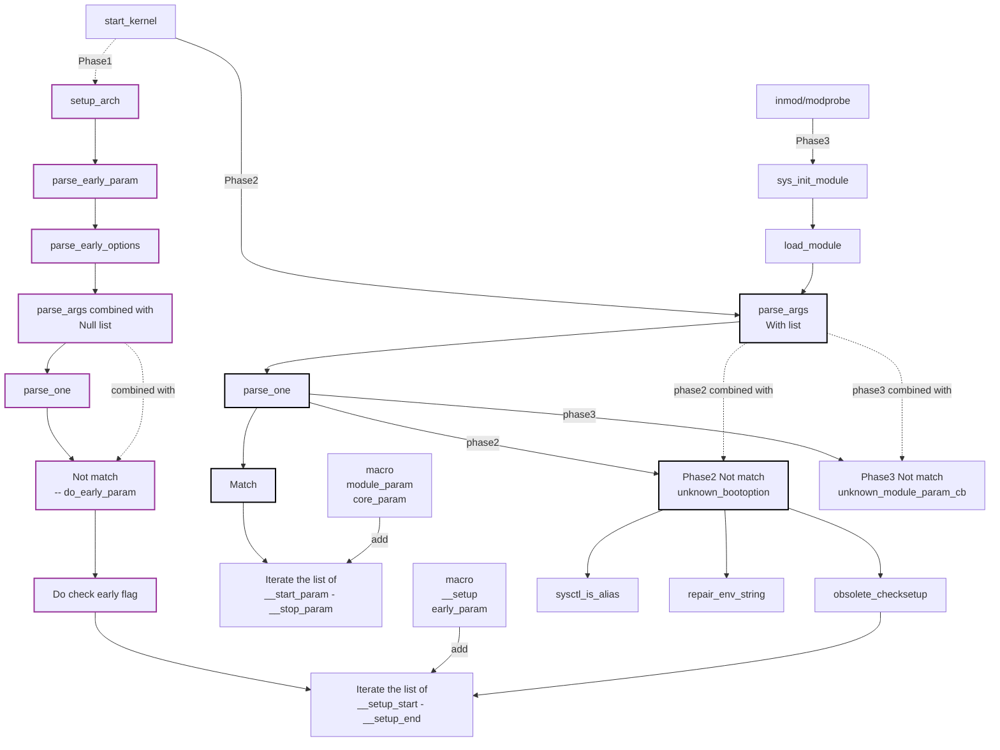

# Kernel Boot Parameters

> Command-line parsing, `__setup` macros, and `early_param`

## How the kernel receives its command line

The kernel's command line originates with the bootloader. GRUB, for example, places the command string in the boot protocol's `boot_params.hdr.cmd_line_ptr` field (a physical address). The arch setup code (`setup_arch()`) copies this into the kernel's address space early in boot.

By the time `start_kernel()` begins, the command line has been copied into two static arrays:

```c
/* init/main.c */
char __initdata boot_command_line[COMMAND_LINE_SIZE];
char *saved_command_line __ro_after_init;
```

`boot_command_line` holds the raw string from the bootloader, preserved verbatim. `saved_command_line` may include additions from `setup_arch()` (e.g., parameters appended by the UEFI stub). A working mutable copy is parsed and consumed by the various parsing stages.

```bash
# See the command line from userspace:
cat /proc/cmdline
# BOOT_IMAGE=/vmlinuz-6.8.0 root=/dev/sda1 ro quiet splash
```

---

## Parsing stages

The kernel parses the command line in three distinct phases. The phase determines which parameters are visible and when.

### Phase 1: `parse_early_param()` — very early

Called from `start_kernel()` before memory allocators are initialized. This phase handles parameters that must be known before the rest of boot can proceed — for example, the amount of usable RAM or which console to use.

Parameters registered with `early_param()` are processed here.

### Phase 2: `parse_args()` — main kernel init

Called from `start_kernel()` after `setup_arch()` and the per-CPU areas are set up. Each token is checked, in order: first against the **built-in module parameters** (`module.param=value` form), then — only on a miss — against `__setup()` handlers (see [`parse_args()` internals](#parse_args-internals) below for exactly how).

Anything not matched by either is treated as either:

- An environment variable to pass to the init process
- An unknown parameter (logged via `pr_notice()`, not a warning)

### Phase 3: module parameters — at module load time

For loadable modules, parameters passed on the `insmod`/`modprobe` command line are parsed when the module is loaded, via `kernel/params.c`. For built-in modules, these appear as `module.param=value` on the kernel command line and are handled during Phase 2.

### Bird view


---

## `early_param()` macro

```c
/* include/linux/init.h */
#define early_param(str, fn) \
    __setup_param(str, fn, fn, 1)
```

The `1` marks this as an early parameter. `parse_early_param()` doesn't filter inside `parse_args()` itself — it calls `parse_args()` with an empty parameter array and `do_early_param()` as the `unknown` callback, and `do_early_param()` is what scans `.init.setup` and skips every entry whose `early` flag isn't set (see [`parse_args()` internals](#parse_args-internals) below).

### Example: `mem=` handler

```c
/* arch/x86/kernel/e820.c */
static int __init parse_memopt(char *p)
{
    if (!p)
        return -EINVAL;
    /* ... parses p into a byte count, clips the e820 map to it ... */
    return 0;
}
early_param("mem", parse_memopt);
```

`arch/x86/kernel/setup.c` — despite hosting most of the rest of `setup_arch()` — registers no `__setup()`/`early_param()` handlers of its own; `mem=` and the other memory-map options below live in `arch/x86/kernel/e820.c` instead. `early_param()` handlers follow the *module-param* return convention, not the `__setup()` one described further down: return `0` for success, non-zero (typically a negative errno) to have the kernel print a warning — the value doesn't mean "handled vs. not handled" the way a `__setup()` handler's return does.

Common parameters handled by `early_param()`:

| Parameter | Handler location | Purpose |
|-----------|-----------------|---------|
| `mem=N` | `arch/x86/kernel/e820.c` | Limit usable RAM |
| `memmap=N@S` | `arch/x86/kernel/e820.c` | Mark memory region |
| `console=` | `kernel/printk/printk.c` (`__setup()`, not `early_param()` — see the note below) | Early console configuration |
| `earlyprintk=` | `arch/x86/kernel/early_printk.c` | Very early console (before `console_init()`) |
| `loglevel=N` | `init/main.c` | Set initial log level |
| `ignore_loglevel` | `kernel/printk/printk.c` | Print all log levels to console |

`console=` is registered with `__setup("console=", console_setup)`, not `early_param()` — it's parsed in Phase 2, not Phase 1.

---

## `__setup()` macro

```c
/* include/linux/init.h */
#define __setup(str, fn) \
    __setup_param(str, fn, fn, 0)

#define __setup_param(str, unique_id, fn, early)             \
    static const char __setup_str_##unique_id[] __initconst  \
        __aligned(1) = str;                                   \
    static struct obs_kernel_param __setup_##unique_id       \
        __used __section(".init.setup")                       \
        __aligned(__alignof__(struct obs_kernel_param))       \
    = { __setup_str_##unique_id, fn, early }
```

Each `__setup()` call places a `struct obs_kernel_param` entry into the `.init.setup` section. `early_param()` uses this same macro with `early=1` — the only difference between the two is that flag, which `do_early_param()` (Phase 1's `unknown` callback, see below) checks when it scans `.init.setup`:

```c
struct obs_kernel_param {
    const char *str;
    int (*setup_func)(char *);
    int early;
};
```

The linker collects all `.init.setup` entries into a contiguous array between `__setup_start` and `__setup_end`. `parse_args()` never iterates this array itself — it's walked by the `unknown` callbacks (`do_early_param()` in Phase 1, `obsolete_checksetup()` in Phase 2), which call the matching `setup_func` when they find an entry whose `str` matches (see [`parse_args()` internals](#parse_args-internals) below for the full picture).

### Writing a `__setup()` handler

```c
static int __init myopt_setup(char *str)
{
    if (!str)
        return 0;

    if (*str == '=')
        str++;

    if (kstrtoint(str, 0, &myopt_value))
        return 0;

    return 1;  /* 1 = successfully parsed, 0 = not handled */
}
__setup("myopt=", myopt_setup);
```

The handler receives a pointer to the value portion of the parameter (everything after `myopt=`). Return `1` if the parameter was recognized and handled, `0` if not (which allows other handlers to try it). The setup string can include the `=` to require a value, or omit it for a bare flag.

### Boolean flag example

```c
static bool myfeature_enabled __initdata = false;

static int __init myfeature_setup(char *str)
{
    myfeature_enabled = true;
    return 1;
}
__setup("myfeature", myfeature_setup);
```

---

## `parse_args()` internals

`parse_args()` (`kernel/params.c`) is generic — it doesn't know about `.init.setup` at all. For each
whitespace-separated token, split on the first `=`, it calls `parse_one()`, which:

1. Linearly scans the `struct kernel_param` array **the caller passed in** for a name match. This is the
   only thing `parse_one()` itself matches against.
2. If nothing matches (or the caller passed an empty array), calls the `unknown` callback the caller
   supplied — what that callback does next depends entirely on which phase is calling.

The `.init.setup` linker-section array (`__setup_start`/`__setup_end`) is walked by two *different*
`unknown` callbacks, not by `parse_one()` itself:

- **Phase 1** (`parse_early_param()` → `parse_early_options()`) passes an empty `params` array — every
  token falls straight through to its callback, `do_early_param()`, which scans `.init.setup` filtered to
  `early`-flagged entries and calls `setup_func()` directly on a match.
- **Phase 2**'s top-level `parse_args()` call (from `start_kernel()`) passes `__start___param`..`__stop___param`
  — the array of **built-in module parameters** (registered with `modname.paramname`-style names baked in
  at compile time, e.g. `net_core.netdev_budget` — there's no special `.`-detection logic; `parameq()` is a
  plain string compare). Only when that array misses does its callback, `unknown_bootoption()`, run
  `obsolete_checksetup()` — a *second*, separate scan of the very same `.init.setup` array, this time for
  non-early `__setup()` entries:

```c
/* init/main.c (simplified) */
static bool __init obsolete_checksetup(char *line)
{
    const struct obs_kernel_param *p = __setup_start;

    do {
        int n = strlen(p->str);
        if (parameqn(line, p->str, n)) {
            if (p->early) {
                /* Already handled in parse_early_param(); just note it. */
            } else if (p->setup_func(line + n))
                return true;
        }
        p++;
    } while (p < __setup_end);

    return false;
}
```

So a Phase-2 token is checked against built-in module params first, `.init.setup` second, and only becomes
a genuinely unknown/init-environment token if both scans miss.

```bash
# Kernel log for an unrecognized parameter:
# Unknown kernel command line parameters "mxcpus=4", will be passed to userspace
```

---

## Module parameters for built-in modules

A module built into the kernel (via `y` in Kconfig rather than `m`) still exposes parameters, but they are parsed from the kernel command line instead of the `insmod` command line:

```c
/* kernel/rcu/tree.c */
static long qhimark = DEFAULT_RCU_QHIMARK;
module_param(qhimark, long, 0444);
```

To set this from the kernel command line:

```
rcutree.qhimark=20000
```

The module name prefix (`rcutree`) is derived from the source file's compiled module name and baked directly into the registered parameter's name at compile time — there's no runtime "does this look like a module parameter" detection; `parse_one()` just does a literal string match (see [`parse_args()` internals](#parse_args-internals) above) against whatever's in the built-in-module-parameter array, dotted prefix and all.

(A parameter that genuinely looks like this — a plain `module_param()` a reader could set via `net_core.netdev_budget=` — used to exist for network polling: `net/core/dev.c`'s `netdev_budget`. It's since migrated to a **sysctl**, `net.core.netdev_budget`, and no longer appears as a command-line-settable `module_param()` or under `/sys/module/` at all.)

### Accessing from sysfs

Module parameters for loaded modules (or built-ins with `0644` permissions) are exposed under `/sys/module/`:

```bash
cat /sys/module/rcutree/parameters/qhimark
10000
```

Parameters marked `0444` (like `qhimark` above) are read-only after boot — the file can be read but not written. Writable ones use `0644`, e.g. `echo 600 > /sys/module/<name>/parameters/<param>`. Parameters marked `0000` do not appear in sysfs at all.

---

## Important kernel parameters

These are parameters whose handlers are worth understanding at a source level:

| Parameter | Handler | Source file |
|-----------|---------|------------|
| `root=/dev/sda1` | `root_dev_setup()` | `init/do_mounts.c` |
| `init=/bin/sh` | `init_setup()` | `init/main.c` |
| `ro` / `rw` | `readonly()` / `readwrite()` | `init/do_mounts.c` |
| `quiet` | `quiet_kernel()` (early_param) | `init/main.c` |
| `debug` | `debug_kernel()` (early_param) | `init/main.c` |
| `panic=N` | `panic_timeout` via `core_param()` | `kernel/panic.c` |
| `maxcpus=N` | `maxcpus()` (early_param) | `kernel/smp.c` |
| `nosmp` | `nosmp()` (early_param) | `kernel/smp.c` |
| `nokaslr` | `cmdline_find_option_bool("nokaslr")` — checked directly in the boot decompressor, before `.init.setup` even exists; there's no `__setup()`/`early_param()` handler for it at all | `arch/x86/boot/compressed/kaslr.c` |
| `nopti` | `pti_parse_cmdline_nopti()` (early_param) | `arch/x86/mm/pti.c` |
| `crashkernel=N` | `parse_crashkernel_dummy()` is the registered `early_param` entry point; it delegates to `parse_crashkernel()` | `kernel/crash_reserve.c` |
| `initcall_debug` | `initcall_debug_enable()` | `init/main.c` |
| `printk.devkmsg=on/off/ratelimit` | — | `kernel/printk/printk.c` |

`core_param()` (`include/linux/moduleparam.h`) isn't a third parsing mechanism alongside `__setup()`/`early_param()` — it's `module_param()`'s own registration primitive, `__module_param_call()`, called with an empty module-name prefix (`""`) instead of the file's real module name. That's why `panic=10` works unprefixed on the command line instead of needing something like `kernel.panic=10`: it lands in the very same built-in-module-parameter array (`__start___param`..`__stop___param`) that ordinary `module_param()` calls populate, just without a dotted prefix in front of it.

### Selecting an init binary

```
init=/bin/sh          # drop to a root shell (recovery)
init=/sbin/init       # explicit sysvinit
init=/lib/systemd/systemd  # explicit systemd (usually the default)
rdinit=/bin/sh        # shell in initramfs (before pivot_root)
```

### Limiting CPUs

```
maxcpus=1    # boot as if uniprocessor (secondary CPUs parked)
nosmp        # equivalent; disables SMP entirely
```

### KASLR control

```
nokaslr      # disable kernel address space layout randomization
             # useful for debugging: makes addresses reproducible across boots
```

---

## Inspecting parameters from kernel code

```c
#include <linux/init.h>

/* Access the preserved command line */
extern char *saved_command_line;

/* Check if a parameter appears anywhere in the command line */
static bool __init has_param(const char *name)
{
    return strstr(saved_command_line, name) != NULL;
}

/* Parse a numeric value from the command line */
static unsigned long __init get_param_ulong(const char *name,
                                             unsigned long defval)
{
    char *p = strstr(saved_command_line, name);
    if (!p)
        return defval;
    p += strlen(name);
    if (*p != '=')
        return defval;
    return simple_strtoul(p + 1, NULL, 0);
}
```

For production code, prefer `early_param()` or `__setup()` over manual string searching — they provide correct lifetime handling, proper error reporting, and the `.init.setup` section cleanup at boot completion.

---

## Further reading

### Kernel source

- [include/linux/init.h](https://git.kernel.org/pub/scm/linux/kernel/git/torvalds/linux.git/tree/include/linux/init.h) — `early_param()`, `__setup()`, `__setup_param()` macros and `struct obs_kernel_param`
- [kernel/params.c](https://git.kernel.org/pub/scm/linux/kernel/git/torvalds/linux.git/tree/kernel/params.c) — `parse_args()` and `parse_one()`: the token-splitting loop and per-token dispatch
- [init/main.c](https://git.kernel.org/pub/scm/linux/kernel/git/torvalds/linux.git/tree/init/main.c) — `boot_command_line`, `saved_command_line`, `parse_early_param()`/`do_early_param()`, and `unknown_bootoption()`/`obsolete_checksetup()` (the `__setup_start`/`__setup_end` linker-section walk)
- [init/do_mounts.c](https://git.kernel.org/pub/scm/linux/kernel/git/torvalds/linux.git/tree/init/do_mounts.c) — `root_dev_setup()`, `readonly()`/`readwrite()`: real, worked `__setup()` handlers for `root=`/`ro`/`rw`
- [include/linux/moduleparam.h](https://git.kernel.org/pub/scm/linux/kernel/git/torvalds/linux.git/tree/include/linux/moduleparam.h) — `module_param()` macro family used by built-in and loadable modules, and `core_param()`'s empty-prefix use of the same `__module_param_call()` primitive
- [arch/x86/kernel/e820.c](https://git.kernel.org/pub/scm/linux/kernel/git/torvalds/linux.git/tree/arch/x86/kernel/e820.c) — `parse_memopt()`/`parse_memmap_opt()`: the real `mem=`/`memmap=` handlers
- [kernel/panic.c](https://git.kernel.org/pub/scm/linux/kernel/git/torvalds/linux.git/tree/kernel/panic.c) — `core_param(panic, panic_timeout, ...)`
- [arch/x86/boot/compressed/kaslr.c](https://git.kernel.org/pub/scm/linux/kernel/git/torvalds/linux.git/tree/arch/x86/boot/compressed/kaslr.c) — `cmdline_find_option_bool("nokaslr")`, checked in the boot decompressor before `.init.setup` exists
- [arch/x86/mm/pti.c](https://git.kernel.org/pub/scm/linux/kernel/git/torvalds/linux.git/tree/arch/x86/mm/pti.c) — `pti_parse_cmdline_nopti()`
- [kernel/crash_reserve.c](https://git.kernel.org/pub/scm/linux/kernel/git/torvalds/linux.git/tree/kernel/crash_reserve.c) — `parse_crashkernel_dummy()` (the registered `early_param` entry point) and `parse_crashkernel()`
- [kernel/rcu/tree.c](https://git.kernel.org/pub/scm/linux/kernel/git/torvalds/linux.git/tree/kernel/rcu/tree.c) — `qhimark`/`module_param(qhimark, ...)`: the built-in module-parameter worked example on this page

### Man pages

- [`proc_cmdline(5)`](https://man7.org/linux/man-pages/man5/proc_cmdline.5.html) — documents `/proc/cmdline`

### Related pages

- [Early Boot and start_kernel()](early-boot.md) — when each parsing phase runs
- [Module Init and Initcalls](initcalls-modules.md) — `module_param()` in loadable modules

### External

- [The kernel's command-line parameters](https://docs.kernel.org/admin-guide/kernel-parameters.html) — the canonical, generated list of every parameter recognized by `__setup()`, `early_param()`, `core_param()`, and `module_param()`
