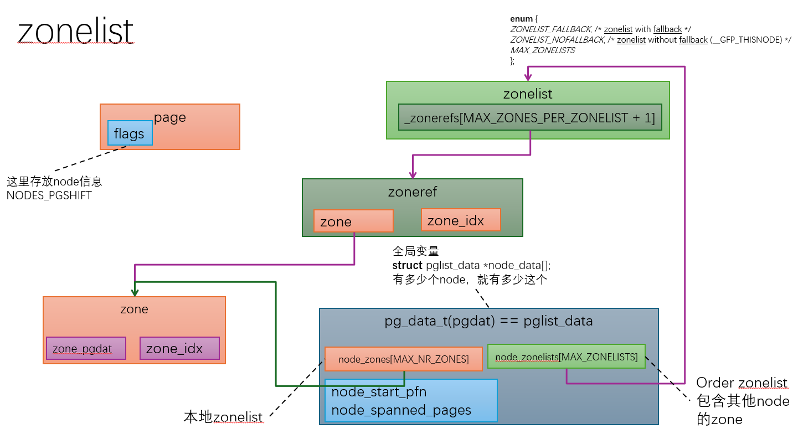

# NUMA Zonelist的构造与回退的顺序

> 当NUMA node里的内存被耗完的时候，内核之前建立的回退列表决定了下一步要在哪里获取内存。当然内存规则可以完全绕过这个回退列表。

## 什么是Zonelist?

每个NUMA node (在内存里是以结构体`pg_data_t`存在, 也被称为`pgdat`)里都有一个zonlists的数组。一个zonelist是一个有序的，以`zoneref`为元素的列表，每条记录都是一个(zone, node)元组。一个分配器就使用这个有优先级的有序数组来满足请求的。

```c
/* include/linux/mmzone.h */

/* Maximum number of zones on a zonelist */
#define MAX_ZONES_PER_ZONELIST (MAX_NUMNODES * MAX_NR_ZONES)

enum {
    ZONELIST_FALLBACK,      /* zonelist with fallback */
#ifdef CONFIG_NUMA
    ZONELIST_NOFALLBACK,    /* zonelist without fallback (__GFP_THISNODE) */
#endif
    MAX_ZONELISTS
};

/*
 * This struct contains information about a zone in a zonelist. It is stored
 * here to avoid dereferences into large structures and lookups of tables
 */
struct zoneref {
    struct zone *zone;   /* Pointer to actual zone */
    int zone_idx;        /* zone_idx(zoneref->zone) */
};

/*
 * One allocation request operates on a zonelist. A zonelist
 * is a list of zones, the first one is the 'goal' of the
 * allocation, the other zones are fallback zones, in decreasing
 * priority.
 */
struct zonelist {
    struct zoneref _zonerefs[MAX_ZONES_PER_ZONELIST + 1];
};
```

每个`pgdat`带有两个zonelists (`node_zonelists[MAX_ZONELISTS]`):

| 索引 | 名称 | 目的 |
|---|---|---|
| `ZONELIST_FALLBACK` | Fallback list | 正常分配; 先选优选节点，然后按NUMA距离排序 |
| `ZONELIST_NOFALLBACK` | No-fallback list | 当设置为“__GFP_THISNODE”时使用;仅为本地节点，绝不跨越其他节点 |

辅助工具“node_zonelist（nid， gfp_flags）”根据GFP标志中是否存在“__GFP_THISNODE”来选择正确的列表：

```c
/* include/linux/gfp.h */
static inline struct zonelist *node_zonelist(int nid, gfp_t flags)
{
    return NODE_DATA(nid)->node_zonelists + gfp_zonelist(flags);
}
```

其中 'gfp_zonelist（）' 如果设置为 '__GFP_THISNODE' 则返回 'ZONELIST_NOFALLBACK'，否则返回 'ZONELIST_FALLBACK'。

### structure view


---

## Zonelists的构建方式

### 入口函数`build_all_zonelists()`

在内核的整个声明周期，有两个点构建Zonelists：

1. **启动** — 在内存初始化时调用“build_all_zonelists（）”。由于系统仍处于“SYSTEM_BOOTING”状态，它委派给“build_all_zonelists_init（）”，后者调用“__build_all_zonelists（NULL）”来重建所有节点。
2. **内存热插拔** — 当节点上线时，再次调用“build_all_zonelists（pgdat）”，并使用新节点的“pgdat”。如果该节点尚未上线，只重建其自身的zonelist;否则所有节点都会重建，使其备用列表反映新的拓扑结构。

```c
/* mm/page_alloc.c */
void __ref build_all_zonelists(pg_data_t *pgdat)
{
    if (system_state == SYSTEM_BOOTING) {
        build_all_zonelists_init();
    } else {
        __build_all_zonelists(pgdat);
    }
    ...
}
```
重建时会保留写侧锁（“zonelist_update_seq”），以便并发配置器——可能在 IRQ 级别运行于 'GFP_ATOMIC' 级别——能够检测重建进程并重新读取 zonelist。

### Node顺序：`build_zonelists()`

对于每个“pgdat”，“build_zonelists（）”通过反复调用“find_next_best_node（）”构造“ZONELIST_FALLBACK”列表，直到访问到所有带内存的节点：

```c
/* mm/page_alloc.c */
static void build_zonelists(pg_data_t *pgdat)
{
    static int node_order[MAX_NUMNODES];
    int node, nr_nodes = 0;
    nodemask_t used_mask = NODE_MASK_NONE;
    int local_node, prev_node;

    local_node = pgdat->node_id;
    prev_node = local_node;

    while ((node = find_next_best_node(local_node, &used_mask)) >= 0) {
        if (node_distance(local_node, node) !=
            node_distance(local_node, prev_node))
            node_load[node] += 1;

        node_order[nr_nodes++] = node;
        prev_node = node;
    }

    build_zonelists_in_node_order(pgdat, node_order, nr_nodes);
    build_thisnode_zonelists(pgdat);
    ...
}
```
内核在启动的时候会打印这个顺序结果，例如： `Fallback order for Node N: 0 1 2 ...`

### 选择下一个最好的Node: `find_next_best_node()`

`find_next_best_node()` 用复合指标对每个未访问节点进行评分：

1. **NUMA距离** — 主信号，通过 `node_distance()`从 ACPI SLIT 表读取。节点越近，得分越低(距离最近)。
2. **CPU 存在感惩罚** — 拥有 CPU（`PENALTY_FOR_NODE_WITH_CPUS`）的节点得分略高于无CPU内存节点。仅内存节点在内核本身的分配压力较小，因此更适合成为溢出目标。
3. **负载均衡**——每个新距离组的第一个节点会施加一个小的`node_load`增量，将分配轮转分配到等距节点之间。
   当本地节点内存不足，内核开始按距离从小到大遍历候选 NUMA 节点：
       先处理距离最近的一组节点（distance group）；
       每次轮到**新距离分组**，就给这一组的第一个节点的 `node_load` 加一小个值；
       这个微小负载增量会影响节点选择打分，让下一次分配会选本组下一个节点；
       最终效果：**同一距离层级的多个节点，内存分配请求被轮流打散**，避免同一距离组内某一个节点被分配打爆。

首选（本地）节点始终置于首位。

### `numa_zonelist_order`的Sysctl配置

内核提供了`/proc/sys/vm/numa_zonelist_order`。在当前内核中，仅实现了`"Node"`顺序。由于实际应用中无用，旧的基于区域的排序模式被移除。sysctl 保留以兼容，但忽略任何不以`'d'`, `'D'`, `'n'`, 或者 `'N'`(匹配 `"Default"` 和 `"Node"`)开头的值，否则会发出警告。

```bash
$ cat /proc/sys/vm/numa_zonelist_order
Node
```

---

## Node内Zone的顺序

在单个节点内，`build_zonerefs_node()` 会从最高的区域索引迭代到零，并将每个生成的zong附加到列表中：

```c
/* mm/page_alloc.c */
static int build_zonerefs_node(pg_data_t *pgdat, struct zoneref *zonerefs)
{
    struct zone *zone;
    enum zone_type zone_type = MAX_NR_ZONES;
    int nr_zones = 0;

    do {
        zone_type--;
        zone = pgdat->node_zones + zone_type;
        if (populated_zone(zone)) {
            zoneref_set_zone(zone, &zonerefs[nr_zones++]);
            check_highest_zone(zone_type);
        }
    } while (zone_type);

    return nr_zones;
}
```

zone类型枚举按升序为：

```c
/* include/linux/mmzone.h */
enum zone_type {
    ZONE_DMA,       /* CONFIG_ZONE_DMA    — small DMA-capable window */
    ZONE_DMA32,     /* CONFIG_ZONE_DMA32  — 32-bit DMA window         */
    ZONE_NORMAL,    /* main addressable memory                         */
    ZONE_MOVABLE,   /* pages that can be migrated or offlined          */
    __MAX_NR_ZONES
};
```

由于循环从`MAX_NR_ZONES - 1`开始*向下*计数，典型的x86-64节点的区域列表中显示为：

```
ZONE_MOVABLE → ZONE_NORMAL → ZONE_DMA32 → ZONE_DMA
```

**为什么是这样的顺序？**分配器首先尝试容量最大的区域（`ZONE_NORMAL`和`ZONE_MOVABLE`共同占据绝大多数内存）。`ZONE_DMA32`和`ZONE_DMA`保留给有严格寻址约束的硬件设备。使用普通内存进行普通分配保护这些有限的DMA支持区域。

---

## 回退算法: 遍历Zonelist

### `for_each_zone_zonelist`家族

分配器的快速路径（`get_page_from_freelist()`）通过以下方式迭代zonelist：

```c
/* include/linux/mmzone.h */

/* Iterate all zones at or below highest_zoneidx */
#define for_each_zone_zonelist(zone, z, zlist, highidx) \
    for_each_zone_zonelist_nodemask(zone, z, zlist, highidx, NULL)

/* Same, but filtered to zones whose node is in nodemask */
#define for_each_zone_zonelist_nodemask(zone, z, zlist, highidx, nodemask) \
    for (z = first_zones_zonelist(zlist, highidx, nodemask), zone = zonelist_zone(z); \
         zone; \
         z = next_zones_zonelist(++z, highidx, nodemask), \
             zone = zonelist_zone(z))
```

`z`是进入zonelist `_zonerefs` 数组的游标（`struct zoneref *`）。推进`++z`即可直接进入下一个条目，无需从头重新扫描——每步，时间复杂度O（1）。

### 水位（watermark）限制

在每个区域，分配者在尝试分配前都检查watermark：

```c
/* mm/page_alloc.c — inside get_page_from_freelist() */
mark = wmark_pages(zone, alloc_flags & ALLOC_WMARK_MASK);
if (!zone_watermark_fast(zone, order, mark,
                         ac->highest_zoneidx, alloc_flags,
                         gfp_mask)) {
    /* watermark failed — skip this zone, continue the loop */
    ...
    continue;
}
/* watermark passed — allocate from this zone */
```

`zone_watermark_ok()` 检查`free_pages - requested > watermark + lowmem_reserve[highest_zoneidx]`。`lowmem_reserve`数组提供每个区域缓冲区，防止高区分配完全耗尽支持DMA的区域。

!!! 注：“分配器不会重试完整列表”
    一旦某个区域的watermark检查失败，该区域将被跳过——循环直接移动到下一个条目。不会从头进行重新扫描。如果回退列表中的所有区域都未通过watermark检查，分配将归入`__alloc_pages_slowpath()`，触发回收、压缩，最终如果内存无法释放则进入OOM。

---

## 内存策略如何修改Zonelist遍历行为

内存策略（`struct mempolicy`）会在`mempolicy.c`中拦截分配路径，并可以更改首选节点或过滤区域列表递代器的节点掩码。

```c
/* include/linux/mempolicy.h */
struct mempolicy {
    atomic_t refcnt;
    unsigned short mode;   /* MPOL_DEFAULT, MPOL_BIND, MPOL_PREFERRED, ... */
    unsigned short flags;  /* MPOL_F_STATIC_NODES, MPOL_F_RELATIVE_NODES, ... */
    nodemask_t nodes;      /* interleave/bind/preferred/etc. */
    int home_node;         /* home node for MPOL_BIND and MPOL_PREFERRED_MANY */
    union {
        nodemask_t cpuset_mems_allowed;
        nodemask_t user_nodemask;
    } w;
    struct rcu_head rcu;
};
```

`mempolicy.c` 中的`policy_nodemask()`函数将策略模式转换为核心配置器使用的`(preferred_nid, nodemask)`对：

```c
/* mm/mempolicy.c */
static nodemask_t *policy_nodemask(gfp_t gfp, struct mempolicy *pol,
                                   pgoff_t ilx, int *nid)
{
    nodemask_t *nodemask = NULL;

    switch (pol->mode) {
    case MPOL_PREFERRED:
        *nid = first_node(pol->nodes);
        break;
    case MPOL_BIND:
        if (apply_policy_zone(pol, gfp_zone(gfp)) &&
            cpuset_nodemask_valid_mems_allowed(&pol->nodes))
            nodemask = &pol->nodes;
        ...
        break;
    case MPOL_INTERLEAVE:
        *nid = (ilx == NO_INTERLEAVE_INDEX) ?
            interleave_nodes(pol) : interleave_nid(pol, ilx);
        break;
    ...
    }

    return nodemask;
}
```

### `MPOL_DEFAULT`

不设置策略对象 (`current->mempolicy == NULL`)。分配器使用当前CPU的节点作为首选节点，且不使用nodemask过滤器。完整的回退列表可用。

### `MPOL_PREFERRED`

`nodes`字段恰好包含一个节点。`policy_nodemask()`将`*nid`设置为该节点，使其成为首选起始点。nodemask过滤器保持为`NULL`，因此如果首选节点用尽，分配器会回退整个`ZONELIST_FALLBACK`列表。

### `MPOL_BIND`

`policy_nodemask()` 返回`&pol->nodes`作为nodemask过滤器。`for_each_zone_zonelist_nodemask` 跳过任何不在该mask中的区域。因此，分配器只考虑被绑定的节点。**如果所有绑定节点都用尽，则不会发生向其他节点的退回** — 分配失败，触发 OOM，而不是溢出到未绑定节点。

!!! 警告 "MPOL_BIND and OOM"
    以 `MPOL_BIND` 绑定到满载节点的进程将被OOM杀手杀死，而不是退回到远程内存。这是有意为之：应用程序明确声明需要本地内存。

### `MPOL_INTERLEAVE`

`interleave_nodes()` 将`current->il_prev`推进到`pol->nodes`中的下一个节点，并返回为该分配的首选节点。区域列表不应用 nodemask 过滤器——如果交错节点暂时耗尽，仍可用正常的缓冲。在多次分配中，页面会轮转分布在允许的节点之间。

### `MPOL_LOCAL`

从当前CPU的NUMA节点分配。`policy_nodemask()`不会修改`*nid`作为`MPOL_LOCAL`（它会过渡到默认情况），因此使用`numa_node_id()`。正常的回退适用。

### 总结

| 策略 | 首选节点 | Nodemask过滤器 | 耗尽之后 |
|---|---|---|---|
| `MPOL_DEFAULT` | Current CPU's node | None | Falls back normally |
| `MPOL_PREFERRED` | Specified node | None | Falls back normally |
| `MPOL_BIND` | First node in mask (or `home_node`) | `pol->nodes` | OOM — no fallback |
| `MPOL_INTERLEAVE` | Round-robin across `pol->nodes` | None | Falls back normally |
| `MPOL_LOCAL` | Current CPU's node | None | Falls back normally |

---

## 实战效果：双节点示例

考虑一个系统，节点0（32 GB）和节点1（32 GB）。NUMA 距离：本地 = 10，远程 = 20。节点0的`ZONELIST_FALLBACK`列表为：

```
[ZONE_NORMAL/node0] → [ZONE_DMA32/node0] → [ZONE_NORMAL/node1] → [ZONE_DMA32/node1]
```

**场景1 — 默认策略，节点0已满：**
在节点0上运行且无显式策略的任务会填满节点0的`ZONE_NORMAL`。`get_page_from_freelist()`在`ZONE_NORMAL/node0`上未通过watermark检查，跳过`ZONE_DMA32/node0`（水印检查也失败或`lowmem_reserve`拒绝），在`ZONE_NORMAL/node1`上成功。分配由节点1以远程延迟方式提供。`numastat`在节点0上记录`numa_miss`，在节点1上记录`numa_foreign`。

**情景2——`MPOL_BIND`到节点0，节点0满了：**
nodemask过滤器限制迭代器只能访问节点0的条目。`ZONE_NORMAL/node0`和`ZONE_DMA32/node0`都未通过watermark检查。没有其他区域通过nodemask过滤器。慢路径未能回收足够的内存，触发了OOM杀手。任务**不会**退回到节点1。

**场景3 — 节点0为`MPOL_PREFERRED`，节点0满：**
首选的nid被覆盖到节点0，但不应用nodemask过滤器。当节点0的区域未通过watermark检查时，迭代器继续`ZONE_NORMAL/node1`，分配成功。行为与默认策略相同，只是即使任务在节点1调度，仍会先尝试节点0。

---

## 实践中观察Fallback

### `numastat`

```bash
numastat
```

| 计数 | 含义 |
|---|---|
| sysfs name | `/proc/vmstat` name | 含义 |
|---|---|---|
| `numa_hit` | `numa_hit` | Allocated on the intended (preferred) node |
| `numa_miss` | `numa_miss` | Allocated on a different node because the preferred node was full |
| `numa_foreign` | `numa_foreign` | A remote task allocated from this node |
| `interleave_hit` | `numa_interleave` | Interleave policy landed on the intended node |
| `local_node` | `numa_local` | Allocated on the local node (CPU and memory are co-located) |
| `other_node` | `numa_other` | Allocated on a non-local node |

高`numa_miss`计数表示首选节点的内存压力以及频繁的回退到远程内存。其实这个数值太大，就说明业务会受到性能影响。

### `/proc/zoneinfo`

```bash
grep -A 20 "Node 0, zone" /proc/zoneinfo
```

每个区域的自由页数和三个watermark（`min`, `low`, `high`）在这里可见。当`free`接近`min`时，该区域对大多数分配的 `zone_watermark_ok()`失败，分配器将跳转到下一个区域列表条目。

### 内核启动日志

启动时，内核打印每个节点的备援顺序：

```
Fallback order for Node 0: 0 1
Fallback order for Node 1: 1 0
```

上面这些内容是从这个函数来的 `build_zonelists()`:

```c
pr_info("Fallback order for Node %d: ", local_node);
for (node = 0; node < nr_nodes; node++)
    pr_cont("%d ", node_order[node]);
```

---

## 关键源文件

| File | What to Look For |
|---|---|
| `include/linux/mmzone.h` | `struct zoneref`, `struct zonelist`, `enum zone_type`, `ZONELIST_FALLBACK`, `ZONELIST_NOFALLBACK`, `MAX_ZONES_PER_ZONELIST`, `for_each_zone_zonelist`, `for_each_zone_zonelist_nodemask`, `enum numa_stat_item` |
| `include/linux/mempolicy.h` | `struct mempolicy` — `mode`, `flags`, `nodes`, `home_node` |
| `include/uapi/linux/mempolicy.h` | `MPOL_DEFAULT`, `MPOL_PREFERRED`, `MPOL_BIND`, `MPOL_INTERLEAVE`, `MPOL_LOCAL`, `MPOL_PREFERRED_MANY` |
| `include/linux/gfp.h` | `node_zonelist()`, `gfp_zonelist()` |
| `mm/page_alloc.c` | `build_all_zonelists()`, `__build_all_zonelists()`, `build_zonelists()`, `build_zonelists_in_node_order()`, `build_thisnode_zonelists()`, `build_zonerefs_node()`, `find_next_best_node()`, `get_page_from_freelist()`, `zone_watermark_ok()`, `__zone_watermark_ok()` |
| `mm/mempolicy.c` | `policy_nodemask()`, `alloc_pages_mpol()`, `interleave_nodes()`, `mempolicy_slab_node()` |

## Further reading

### Kernel source

- [mm/page_alloc.c](https://git.kernel.org/pub/scm/linux/kernel/git/torvalds/linux.git/tree/mm/page_alloc.c) — `build_all_zonelists()`, `build_zonelists()`, `find_next_best_node()`, `get_page_from_freelist()`, `zone_watermark_ok()`
- [mm/mempolicy.c](https://git.kernel.org/pub/scm/linux/kernel/git/torvalds/linux.git/tree/mm/mempolicy.c) — `policy_nodemask()`, `alloc_pages_mpol()`, and all memory policy mode implementations
- [include/linux/mmzone.h](https://git.kernel.org/pub/scm/linux/kernel/git/torvalds/linux.git/tree/include/linux/mmzone.h) — `struct zonelist`, `struct zoneref`, `for_each_zone_zonelist_nodemask`, `ZONELIST_FALLBACK`, `ZONELIST_NOFALLBACK`

### Kernel documentation

- `Documentation/admin-guide/mm/numa_memory_policy.rst` — reference for all `MPOL_*` policy modes and how they interact with the zonelist ([rendered](https://docs.kernel.org/admin-guide/mm/numa_memory_policy.html))

### LWN articles

- [GFP flags and memory zones](https://lwn.net/Articles/629925/) — how GFP flags select zones and interact with the fallback list

### Related docs

- [NUMA Memory Management](numa.md) — memory policy overview: `set_mempolicy()`, `mbind()`, `numactl`, and automatic NUMA balancing
- [NUMA Distance and Inter-Socket Latency](numa-distance.md) — how `node_distance()` values drive `find_next_best_node()` scoring
- [NUMA Effects on Memory Reclaim](numa-reclaim.md) — per-node kswapd, watermarks, and how `MPOL_BIND` interacts with OOM
- [Page Allocator](page-allocator.md) — the full allocation path from `__alloc_pages()` through the zonelist to the buddy allocator
